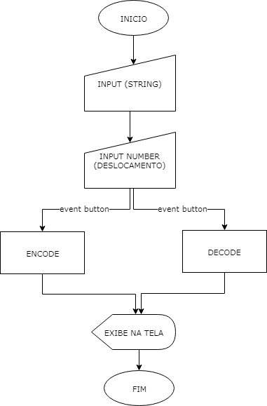

# Cifra de César

## Introdução

O projeto foi desenvolvido para um usuário que deseja esconder as mensagens compartilhadas com amigos e familiares, para realizar um aniversário surpresa de sua mãe.

## Objetivos

Construir uma aplicação web, usando os conhecimentos de User Experience Design, JavaScript, construir uma interface, escutar eventos básicos do DOM, escrever a lógica que cifra e descifra mensagens, realizar testes básicos que comprovem (e documentem) esta lógica, e finalmente manipular o DOM para que ele mostre e imprima os resultados.

* Usar VanillaJS.
* Permitir escrever um texto, com letras maiúsculas e  minúsculas, para ser cifrado ou decifrado.
* Mostrar o resultado da cifra e descifrado corretamente.
* Permitir escolher o offset (deslocamento) a ser usado na cifragem/descifragem.
* Criar testes unitários.

## Diagrama de blocos:
